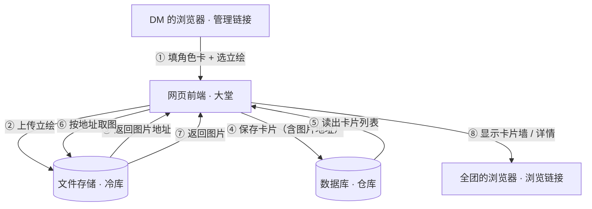

# TECH_DESIGN.md —— 跑团角色卡画廊 · 技术设计（Day 5）

> 作者：Percy ｜ 日期：2026-09-20 ｜ 状态：待审
> 上游文档：PRD.md（Day 4）｜ 下游：Day 6 开发 → Day 7 上线

## 1. 技术路线（一句话）

**纯前端网页（HTML/CSS/JS） + WorkBuddy 云服务（数据库存角色卡、文件存储存立绘） + 「发布为应用」上线拿链接。**

## 2. 方案比较与取舍

| 方案 | 做法 | 代价 / 风险 |
|---|---|---|
| **甲（已选）** | 纯前端 + WorkBuddy 云服务 | 绑定 WorkBuddy 生态，脱离该环境跑不起来 |
| 乙 | 纯前端 + Supabase（国外后端服务） | 需注册；境外网络稳定性未知；中文支持弱 |
| 丙 | 自己写 Node.js 后端 + 本地数据库 | 代码量翻倍，两天工期吃紧；Day 7 要外网访问需买服务器 / 内网穿透 / 备案 |

**选甲的三条理由：**

1. **需求正好撞上现成能力**——本项目要的就是"存结构化数据"+"存图片"两件事，云服务都现成提供；自己写后端等于有食材却从头搭灶台。
2. **零基础 + 两天工期**——方案丙代码量翻倍，且上线链路长；方案乙需要注册与境外网络，本项目前两天已实际遇到 `api.github.com` 不可达的情况，风险不可控。
3. **上线路径最短**——Day 7 一次发布即可拿到可访问网址，把有限时间留给功能本身。

**如实记录的代价**：前端代码是通用的、可以整体搬走；云端那部分（数据库、文件存储）属于该平台，迁移需重接。

## 3. 技术栈清单

| 角色 | 用什么 | 为什么是它 |
|---|---|---|
| 页面（前端） | HTML + CSS + JavaScript，不用框架 | 只有画廊墙 / 详情 / 表单 3 类页面；框架为大型项目省重复劳动，两天项目学框架成本大于收益 |
| 云端读写 | WorkBuddy 云服务 SDK（`<script>` 引入） | 项目没有构建步骤，用 CDN 方式引入最省事，不额外引入打包工具 |
| 数据库 | WorkBuddy 云服务 · 数据库 | 角色卡是结构化数据，需要能按团列出、能查、能改 |
| 文件存储 | WorkBuddy 云服务 · 文件存储 | 立绘是图片，单独存放，数据库里只记一个地址 |
| 响应式布局 | CSS（媒体查询） | 验收 #7 要求手机浏览器无横向滚动 |
| 上线 | WorkBuddy「发布为应用」 | 直接获得可访问网址，无需购买服务器与备案 |
| 版本管理 | Git + GitHub（已在用） | 每天一个 `Day X｜` 提交，改动可追溯、可回退 |

## 4. 数据流图

> **本图对应的技术路线**：纯前端网页 + WorkBuddy 云服务（数据库存角色卡、文件存储存立绘）+ 发布上线交给全团访问。



**文字版（本地打开 Markdown 时的兜底，防止图表不渲染）：**

```
DM 的浏览器 ──① 填卡+选图──▶ 网页前端 ──② 上传立绘──▶ 文件存储（冷库）
                                  ▲                        │
                                  └──────③ 返回图片地址─────┘
网页前端 ──④ 保存卡片（含图片地址）──▶ 数据库（仓库）
数据库 ──⑤ 读出卡片列表──▶ 网页前端 ──⑥ 按地址取图──▶ 文件存储
文件存储 ──⑦ 返回图片──▶ 网页前端 ──⑧ 显示卡片墙/详情──▶ 全团的浏览器
```

**"数据从哪来、到哪去"一句话版：**

| 数据 | 从哪来 | 到哪去 |
|---|---|---|
| 角色卡文字（名字 / 简介 / 属性 / 背景） | DM 在管理链接里的表单 | 数据库，存成一条记录 |
| 立绘图片 | DM 选的本地图片文件 | 文件存储；数据库那条记录里只留它的地址 |
| 浏览请求 | 全团点开浏览链接 | 网页向数据库取卡片、按地址向文件存储取图，最后画成画廊墙 |

## 5. 数据结构草案（一张角色卡长什么样）

| 字段 | 类型 | 说明 |
|---|---|---|
| id | 文本 | 唯一编号，自动生成，用来定位"要更新哪张卡" |
| name | 文本 | 角色名（画廊墙卡片上显示的那行字） |
| summary | 文本 | 简介，一两句话 |
| attributes | 长文本 | 属性（规则数值等） |
| background | 长文本 | 背景故事 |
| portrait_url | 文本，可为空 | 立绘在文件存储里的地址；为空时页面显示占位图（验收 #2） |
| created_at | 时间 | 首次录入时间 |
| updated_at | 时间 | 最后更新时间（验收 #4 要显示它） |

## 6. 风险与备选

| # | 风险 | 应对 / 备选 |
|---|---|---|
| 1 | **管理链接口令不防技术高手**：链接里带的是一串口令，懂技术的人拿到管理链接即可修改 | MVP 阶段（团内使用、链接不外传）够用；真安全需账号系统（已进 PRD 红线）。此局限如实记录，不含糊 |
| 2 | 云服务开通时可能遇额度 / 资源紧张 | Day 6 首次开通会由 WorkBuddy 弹窗请你确认；若遇资源紧张则按清单降级策略处理并记录待办 |
| 3 | 立绘超限（>5MB）或格式不对 | 前端选择文件时即校验类型与大小，超限给友好提示（验收 #6） |
| 4 | 上线后域名与云端必须绑定同一个应用 | 发布时复用同一个应用 ID，绝不新建应用，否则云端请求会因来源不匹配被拒 |
| 5 | 手机端显示错乱 | 用响应式 CSS，开发时即用手机浏览器自查（验收 #7） |

## 附：本期不做（沿用 PRD 第 4 节）

账号/登录系统、在线跑团战地图、多规则支持、历史版本管理、AI 自动生成立绘、公开画廊/社交、移动端 App —— 均不在本期技术范围内。
